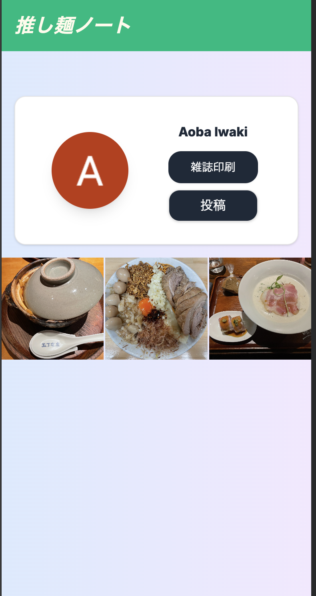
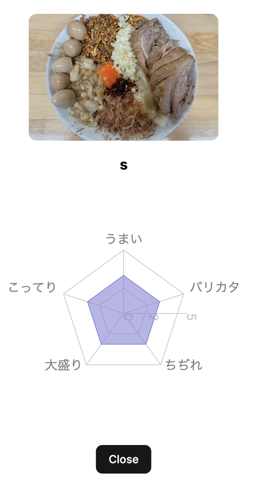

# 推し麺ノート
推しのラーメンを投稿して雑誌風にプリントアウトするWebアプリ

## アプリの画面




# DBマイグレート

```sh
docker compose exec api bundle exec rails db:migrate
```

# APIデバッグ CURLコマンド

```sh
$ curl -X POST http://localhost:8000/v1/users \
     -H "Content-Type: application/json" \
     -d '{"google_id": "test", "nickname": "test_user"}'
```

# api

## 初期データ投入
```
docker compose exec api bundle exec rails db:seed
```
